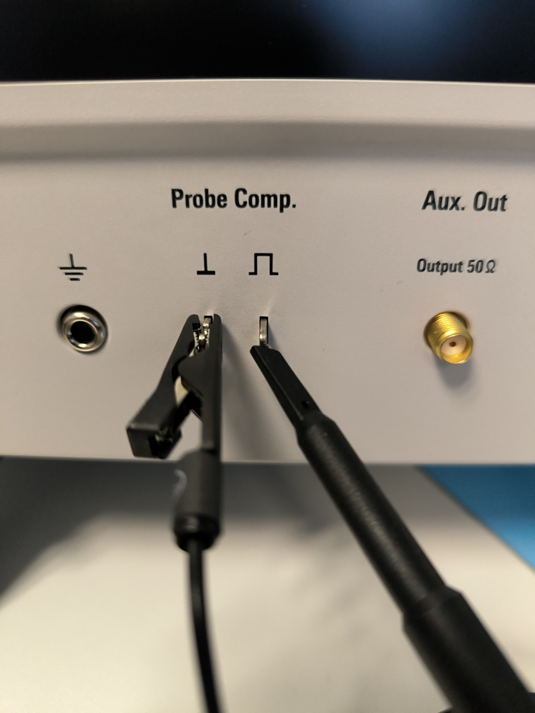

### Probes Kurzfassung
Der Unterschied zwischen aktiven und passiven Tastköpfen ist eigentlich ganz spannend. Die passiven Probes sind sozusagen die einfachen, die brauchen keine extra Stromversorgung, die sind einfach direkt angeschlossen und beeinflussen das Signal nur minimal.

Die aktiven Probes hingegen haben eine eingebaute Elektronik, die ihnen ein bisschen mehr „Power“ verleiht. Das heißt, sie können Signale mit einer höheren Bandbreite oder sehr geringe Spannungen genauer messen, weil sie eben diese aktive Verstärkung drin haben.

Also kurz gesagt: Passiv ist simpel und robust, aktiv ist ein bisschen komplexer, aber dafür eben auch leistungsfähiger. Also, wenn du was empfindliches oder ultraschnelles messen willst, nimmst du eher eine aktive Probe. Wenn’s ein bisschen robuster und straightforward sein soll, dann reicht oft ein passiver Tastkopf.

Genau – jetzt bist du mitten im Kern der Oszi-Messung: **die ADC-Samplingrate** entscheidet, ob du ein digitales Signal **richtig auflöst** oder Aliasing bekommst. Ich erkläre Schritt für Schritt, praxisnah.

---
### High Speed Signals

Oszi-Messung: **die ADC-Samplingrate** entscheidet, ob du ein digitales Signal **richtig auflöst** oder Aliasing bekommst. 

## 1️⃣ Wie ein Oszi eigentlich misst

1. Eingangssignal → Probe → Oszi-Eingang
2. Signal wird ggf. durch **Bandbreitenfilter** geleitet
3. Signal geht in **ADC** (Analog-Digital-Converter)
4. ADC misst **diskret in Zeit** → Samplingrate
5. Oszi baut aus den diskreten Samples die Kurve wieder auf

**Wichtig:** Wenn die **Samplingrate zu niedrig** ist, passieren Aliasing-Effekte.

---

## 2️⃣ Samplingrate: Faustregeln

### Für digitale Signale:

[
f_\text{Sample} \gtrsim 2 \cdot f_\text{Signalmax} \quad (\text{Nyquist})
]

**Besser in der Praxis:**

* 5–10× der **Bitrate** oder **Rise-Time-Frequenz**
* Grund: Flanken und Jitter korrekt sichtbar

---

### Beispiele

| Signal                      | Rise-Time | Relevante Frequenz (f_\text{max}) | Minimal Sample | Empfehlung |
| --------------------------- | --------- | --------------------------------- | -------------- | ---------- |
| SPI 10 MHz, 5 ns Flanke     | 5 ns      | 0,35/5ns = 70 MHz                 | 140 MS/s       | 500 MS/s   |
| LVDS 1 Gbit/s, 300 ps       | 0,3 ns    | 0,35/0,3 ns ≈ 1,17 GHz            | 2,5 GS/s       | 5 GS/s+    |
| USB 2.0, 480 Mbit/s, 500 ps | 0,5 ns    | 0,35/0,5 ns ≈ 700 MHz             | 1,5 GS/s       | 3 GS/s+    |

> Tipp: **„Faktor 5–10“** immer nehmen, dann siehst du Flanken und Jitter sauber.

---

## 3️⃣ Wie stellt man die Samplingrate ein?

* **Fast alle modernen Oszis** machen das automatisch:

```
Timebase / Horizontal Scale → Auto Sample Rate
```

* Oder man wählt manuell:

```
Timebase (s/div) ↓ → Sample-Rate ↑
Timebase ↑ → Sample-Rate ↓
```

**Merksatz:**

> Je schneller die Signalflanke, desto **kleiner die Zeit/Div → höhere Sample-Rate**

---

### 3.1 Typische Settings

| Signaltyp                            | Empfehlung               |
| ------------------------------------ | ------------------------ |
| Langsam (<10 MHz)                    | Auto, 50–100 MS/s reicht |
| Mittel (10–100 MHz)                  | 500 MS/s – 1 GS/s        |
| Schnell (100 MHz – 1 GHz)            | 2–5 GS/s                 |
| Very High-Speed (>1 Gbit/s LVDS/USB) | 5–20 GS/s (je nach Oszi) |

---

## 4️⃣ Zusammenhang Bandbreite ↔ Samplingrate

| Parameter             | Effekt                                                 |
| --------------------- | ------------------------------------------------------ |
| Bandbreite zu klein   | Eye wird „rund“, Flanken zu langsam, linear            |
| Samplingrate zu klein | Aliasing, falsche Bits, Augen verschoben, nicht-linear |
| Beides richtig        | Eye korrekt, Flanken, Jitter und Timing sichtbar       |

---

## 5️⃣ Praxis-Tipps

1. **Erste Wahl:** volle Bandbreite + automatische Sample-Rate
2. **Zeitbasis prüfen:** kleine s/div → höhere Samplingrate
3. **Zoom:** für Jitter / Rise-Time immer höher sampeln
4. **Wenn Oszi limit:** Eye-Masken / Trigger-Optionen nutzen

---

💡 Merksatz für High-Speed:

> **„Rise-Time bestimmt Bandbreite, Bitrate + Rise-Time bestimmen Samplingrate“**

---

### Eye-Diagram

1. **Was bringt das Eye-Diagramm überhaupt?**
2. **Was sagt es dir konkret über Bandbreite & Signalqualität?**
3. **Soll / darf man am Oszi die Messbandbreite bei digitalen Signalen begrenzen – und wie?**

---

## 1️⃣ Was bringt ein Eye-Diagramm?

Ein Eye-Diagramm ist **kein neues Signal**, sondern:

> **Viele Bitzeiten übereinandergelegt**, getriggert auf den Bit-Takt.

Dadurch siehst du **statistische Effekte**, die man im Zeitverlauf kaum erkennt.

### Ein einzelnes Signal sagt:

> „So sieht *dieses* Bit aus.“

### Das Eye sagt:

> „So gut funktioniert *der Kanal insgesamt*.“

---

## 2️⃣ Was kann man im Eye sehen, was man sonst nicht sieht?

### 👁️ Das „Auge“ besteht aus vier kritischen Größen:

### 1. **Eye Height** (vertikal)

* Wie viel Spannungsmarge?
* Rauschen?
* Amplitudendämpfung?

👉 Schlecht bei:

* zu wenig Bandbreite
* Dämpfung
* falscher Terminierung

---

### 2. **Eye Width** (horizontal)

* Wie viel Timing-Reserve?
* Jitter?
* ISI (Inter-Symbol-Interference)?

👉 Schlecht bei:

* zu langsamen Flanken
* Reflexionen
* Dispersion

---

### 3. **Crossing-Point**

* Symmetrie?
* Duty-Cycle-Distortion?

👉 Wichtig bei LVDS & USB

---

### 4. **Augenöffnung**

* Kann der Empfänger **sicher** sampeln?

👉 **Das ist die eigentliche Antwort auf „funktioniert es?“**

---

## 3️⃣ Zusammenhang Eye ↔ Bandbreite

### Zu geringe Bandbreite → Eye schließt sich

Was passiert konkret:

* hohe Frequenzen fehlen
* Flanken werden flacher
* Bits „verschmieren“ ineinander (ISI)

📉 Ergebnis:

* Eye wird **schmaler**
* Sampling-Fenster kleiner
* Bitfehlerwahrscheinlichkeit steigt

👉 **Das Eye zeigt dir Bandbreitenprobleme sofort.**

---

## 4️⃣ Jetzt zur Kernfrage:

### „Kann / soll ich am Oszi die Messbandbreite einstellen?“

### ✅ Ja, man *kann* – aber **mit Bedacht**.

---

## 5️⃣ Oszi-Bandbreite vs. Eye-Diagramm

### Fall A: **Debug / Verstehen**

* Bandbreite: **FULL**
* Ziel: Alles sehen, auch Probleme

✔️ Richtig für:

* Design-Debug
* Ursachenanalyse

---

### Fall B: **Compliance / Realitätsnähe**

* Bandbreite: **begrenzt** (z. B. Standard-konform)
* Ziel: So messen, wie der Empfänger „sieht“

✔️ Richtig für:

* USB, Ethernet, LVDS-Specs
* Abnahmemessungen

📌 Viele Standards **fordern explizit Filter**!

---

## 6️⃣ Konkrete Beispiele

### 🔹 LVDS

* Empfänger hat begrenzte Bandbreite
* Eye-Messung oft **mit Filter**
* Ohne Filter → „zu pessimistisch“

👉 Bandbreite **nicht beliebig hochdrehen**

---

### 🔹 USB 2.0

* Eye-Masken gelten **nach definiertem Filter**
* Oszi ohne Filter → falsches Ergebnis

---

### 🔹 SPI / I²C

* Eye-Diagramm selten sinnvoll
* Bandbreitenlimit meist egal
* Zeitmessung wichtiger

---

## 7️⃣ Wie stellt man das am Oszi ein?

### Typischer Weg (herstellerunabhängig):

**Pro Kanal:**

```
Channel → Bandwidth → Full / 20 MHz / Custom
```

**Für Eye:**

```
Acquire → Eye / Persistence
Math / Analysis → Eye Diagram
```

Manche Oszis:

* haben **Standard-konforme Filter**
* oder Eye-Optionen (USB, Ethernet, etc.)

---

## 8️⃣ Wichtigste Regel (bitte merken!)

> 🔥 **Bandbreite nie reduzieren, um ein Eye „schön“ zu machen**,
> sondern nur, wenn es **der Standard verlangt**.

---

## 🧠 Zusammenfassung in einem Bild (gedanklich)

* Zeitbereich → „Was passiert jetzt?“
* Eye → „Wie robust ist das System?“
* Volle BW → Fehler finden
* Begrenzte BW → Norm erfüllen

---

### Passive Probes -AutoNorm


Da vermischen sich **drei Dinge**, die im Alltag gern alle „Autonorm“ genannt werden. Ich sortiere das sauber und sage dir **konkret, was du bei passiven Probes tun musst**.

---

## 1️⃣ Erstmal klären: Was meinst du mit „Autonorm“?

Mit passiven Tastköpfen gibt es **drei typische Schritte**:

1. **Auto-Setup / Auto-Scale** (Oszi richtet sich selbst ein)
2. **Probe-Faktor einstellen (1:10)**
3. **Probe kompensieren** (DER wichtige Teil!)

Die Leute sagen oft „Autonorm“, meinen aber eigentlich **Punkt 3**.

---

## 2️⃣ Auto-Setup (das Einfache)

### Was das ist

* Oszi stellt **Zeitbasis, Vertikal-Skalierung, Trigger** automatisch ein
* Heißt je nach Hersteller:

  * *Auto Setup*
  * *Auto Scale*
  * *Autoset*

### Wie?

👉 **Ein Knopf** am Oszi, meist „AUTO“

### Wann sinnvoll?

* Zum **schnellen Draufschauen**
* Zum „Ist da überhaupt ein Signal?“

⚠️ **Nicht vertrauen** für:

* Timing
* Jitter
* saubere Pegelmessung

---

## 3️⃣ Probe-Faktor einstellen (1:10) – MUSS sein

### Warum?

Passive Probes sind fast immer **10:1**.

Wenn das Oszi das nicht weiß:

* falsche Spannung
* falsche Trigger-Level
* falsche Messwerte

### Einstellung

```
Channel → Probe → Attenuation → 10X
```

📌 Das ist **keine Automatik**, das musst du prüfen.

---

## 4️⃣ DAS WICHTIGSTE: Passive Probe kompensieren

👉 Das ist vermutlich das, was du wirklich meinst.

### Warum nötig?

Eine passive 10:1-Probe ist:

* Widerstandsteiler
* **RC-Netzwerk**

Die Probe **muss zum Oszi-Eingang passen**, sonst:

* Flanken sind falsch
* Überschwingen oder Rundung
* Timing-Messungen falsch

---

### Wie macht man das richtig?

#### Schritt-für-Schritt

1. **Probe auf 10:1**
2. **Oszi-Kanal auf 10X**
3. Probe an den **Kalibrier-Ausgang** des Oszis
   (meist: ~1 kHz, ~1 V Rechteck)
4. Masse kurz anschließen
5. Rechteck anzeigen
6. **Kleines Trimmer-Schraubchen** an der Probe drehen

---

### Zielbild

| Bild                 | Bedeutung                 |
| -------------------- | ------------------------- |
| 🟦 Abgerundet        | **Unterkompensiert**      |
| 🟥 Überschwinger     | **Überkompensiert**       |
| 🟩 Sauberes Rechteck | ✅ **Richtig kompensiert** |

👉 Das ist **keine Kosmetik**, sondern echte Kalibrierung.

---

## 5️⃣ Wie oft muss man das machen?

* Bei **neuer Probe**
* Wenn man an **anderes Oszi** geht
* Wenn es **temperaturmäßig anders** ist
* Wenn man **präzise Timing-Messungen** macht

💡 Profis machen das **jeden Morgen im Labor**.

---

## 6️⃣ Was Autonorm NICHT kann

❌ Probe automatisch kompensieren
❌ Kapazität der Probe erraten
❌ Messfehler durch lange Masseleitungen korrigieren

---

## 7️⃣ Mini-Checkliste (passive Probe anschließen)

1. Probe auf **10:1**
2. Oszi-Kanal auf **10X**
3. **Probe kompensieren**
4. Masse **so kurz wie möglich**
5. Erst dann messen

---

## 🧠 Merksatz

> *Auto-Setup richtet das Bild ein – Probe-Kompensation richtet die Physik ein.*

Wenn du willst, erkläre ich dir als Nächstes:

* 🔍 warum passive Probes bei schnellen Signalen scheitern
* 🧪 wie sich falsche Kompensation im Eye oder Timing zeigt
* 📏 wann man **nie** mehr kompensieren muss (aktive Probes)

Sag einfach.


### Kompensieren genauer


Ja 👍 **genau so** – das ist **richtig angeschlossen**.
Jetzt noch kurz **einordnen, was wir sehen**, und dann sage ich dir **was als Nächstes passieren muss**, sonst ist es noch nicht „fertig“.

---

#### 🔍 Was ist auf dem Bild richtig?

Ich beschreibe es explizit, damit klar ist, dass wir vom selben reden:

* Links: **Masse (⏚)** → Masseklemme der Probe ✔️
* Mitte: **Probe Comp** → Rechteck-Ausgang ✔️
* Rechts: **Aux Out (50 Ω)** → *nicht benutzt* ✔️ (gut so)

👉 Du hast:

* **Signalspitze** der Probe auf den **Rechteck-Pin**
* **Masseklemme** auf **GND**
* **kurze Verbindung**

Das ist **genau das Setup**, das man für die **Probe-Kompensation** braucht.

---

#### 1️⃣ Was solltest du jetzt am Oszi sehen?

Ein **Rechtecksignal**, typischerweise:

* ~1 kHz
* ~1 Vpp (manchmal 3–5 Vpp)
* saubere Triggerung

Wenn du **Auto-Setup** drückst, solltest du sofort ein stabiles Bild haben.

---

#### 2️⃣ Jetzt kommt der entscheidende Schritt (der oft vergessen wird!)

👉 **Probe kompensieren**

An der Probe (meist im BNC-Kopf oder Griff) ist ein **kleines Schraubloch**.

##### Während du auf das Rechteck schaust:

| Oszi-Bild         | Bedeutung        | Aktion         |
| ----------------- | ---------------- | -------------- |
| Flanke rund       | Unterkompensiert | Trimmer drehen |
| Überschwingen     | Überkompensiert  | Trimmer zurück |
| Sauberes Rechteck | ✅ Perfekt        | Fertig         |

🎯 Ziel: **flache Oberkante, senkrechte Flanken**

---

#### 3️⃣ Typische Stolperfallen (alles okay bei dir 👍)

* ❌ Masse vergessen → nein
* ❌ Aux Out benutzt → nein
* ❌ Lange Masseleitung → nein
* ❌ Probe auf 1:1 → **prüfen!**

👉 **Ganz wichtig:**
Am Oszi muss der Kanal auf **10X** stehen:

```
Channel → Probe → Attenuation → 10X
```

---

#### 4️⃣ Wann ist das „gültig“?

Die Kompensation gilt:

* **nur für dieses Oszi**
* **nur für diese Probe**
* **für diese Temperatur / Umgebung**

Deshalb:

> Bei Oszi-Wechsel → neu kompensieren

---

#### 🧠 Merksatz (Laborstandard)

> *Probe Comp ist kein Test – es ist eine Kalibrierung.*

---

Wenn du willst, kannst du mir als Nächstes:

* sagen **wie das Rechteck bei dir aussieht** (rund / overshoot / ok), oder
* ein Foto vom Oszi-Bild schicken

Dann sage ich dir **exakt**, wie weit du drehen musst und ob deine Probe noch gesund ist.


### Schutzleiter
Sobald der Schutzleiter mit im Spiel ist, kann man natürlich auch über Erdschleifen stolpern. Das ist so ein klassisches Thema: Man hat auf der einen Seite die stabile Erdung, aber wenn man an mehreren Punkten geerdet ist und dann irgendwo ein Potentialunterschied entsteht, kann so eine Erdschleife auch mal Störsignale verursachen.

Aber keine Sorge, das kriegen wir in den Griff. Wir können einfach mal drüber reden, wie du das in deinen Setups vermeiden kannst, sodass du ein schön sauberes Signal behältst.

Es gibt da ein paar Tricks, ganz ohne Transformator diese Erdschleifen in den Griff zu kriegen. Zum Beispiel kannst du darauf achten, nur ein Gerät wirklich bewusst zu erden und bei den anderen auf diese Mehrfacherdung zu verzichten. Oder du kannst geschirmte Kabel nutzen, die an einer Seite den Schutz entfernt haben, damit sich keine Schleife bildet.

Im Grunde ist es ein bisschen wie Detektivarbeit an deinem Aufbau, um zu schauen, wo du unnötige Erdungen vermeiden kannst.

